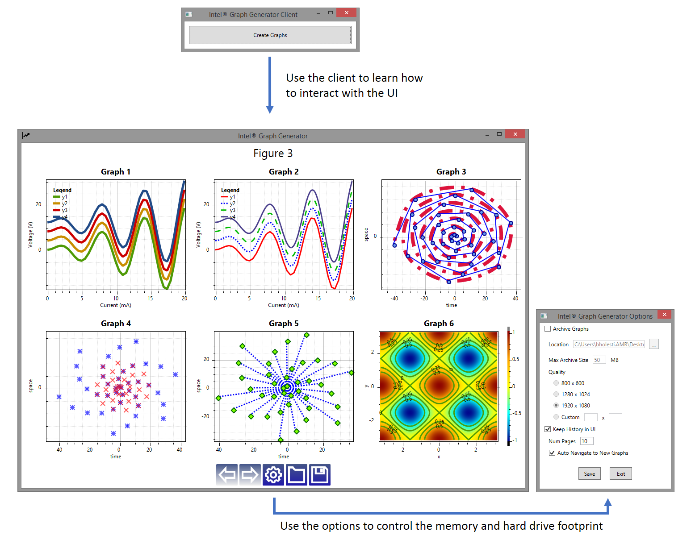

DISCONTINUATION OF PROJECT.

This project will no longer be maintained by Intel.

Intel has ceased development and contributions including, but not limited to, maintenance, bug fixes, new releases, or updates, to this project. 

Intel no longer accepts patches to this project.

If you have an ongoing need to use this project, are interested in independently developing it, or would like to maintain patches for the open source software community, please create your own fork of this project. 
# Intel&reg; Graph Generator

This software is a general purpose graphing solution that exposes a web service allowing it to be used in a variety of work flows where visualizaiton of numeric data is helpful. It was developed with Visual Studio 2010 but can easily be ported to newer environments. 

## Getting Started

Pull and build the source code with Visual Studio 2010. Launch GraphUI.exe as administrator to expose the web service. Launch Client.exe and push the buttons to create graphs and you should see them appear in GraphUI.exe. GraphProxy.dll is a third project that simplifies communication with the web service.

### Prerequisites

Windows 8.1
Visual Studio 2010

### Installing

Follow standard installaiton instructions for Windows and Visual Studio.

## Running the tests

Client.exe performs a series of calls to the web service if you see graphs in GraphUI.exe everything is working correctly.

## Deployment

This is a stand alone set of binaries that do not need and special deployment other than the dependencies already mentioned. 

## Built With

* Visual Studio 2010

## Authors

* **Jennifer Horn** - *Initial work*
* **Brian Holestine** - *Productization*

## License

This project is licensed under the MIT License - see the [LICENSE.txt](LICENSE.txt) file for details

## Acknowledgments

* Jennifer Horn for all her hard work investigating technologies and prototyping
* OxyPlot for their graphing solution which this project relies on
